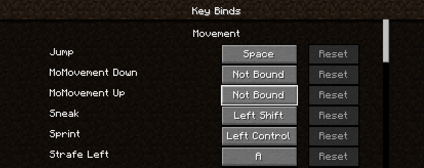

# Welcome!

## What is this mod and what does it do?
This is just a small mod i coded for minecraft to add more movement / parkor because i wanted to. 

It adds vaulting, wall-running , vaulting (In alpha still) , rolling (Which can cancle fall damage if timed right), also Ledge grabbing, and sliding.

## How do i use it?
Well once you have it installed go the controls menu and you have to bind mo-movment up and down (See the image below)

### What does each key do?

#### MoMovement Down Key (`MoMovement.INPUT.ismoveDownKeyPressed()`):
- **Wall Run:** Initiates or continues a wall run if the player is near a wall and not on the ground.
- **Slide:** Initiates a slide if the player is sprinting and on the ground.
- **Dive Roll:** Initiates a dive roll if the player is in the air and moving fast enough.
- **Ledge Grab:** Initiates a ledge grab if the player is falling and near a ledge.
- **Hanging:** Adjusts the player's vertical velocity while hanging under a block.

#### MoMovement Up Key (`MoMovement.INPUT.ismoveUpKeyPressed()`):
- **Vaulting:** Initiates vaulting over an obstacle if the player is near a vaultable block.
- **Climbing:** Moves the player upwards while hanging under a block.
- **Ledge Climb:** Climbs up a ledge if the player is in the ledge grabbing state.

#### Dev info for keys 
 Keys translate keys are 
  - (``key.momovement.up``)
  - (``key.momovement.down``)

## Wanna add something to the mod or find a bug?
  * #### If you find a bug
       - please open an issue [Here](https://github.com/hotsu0p/MoMovement/issues)

  * #### Wanna add somthing? 
       - Make a for then open a pull request and pelase state what you added/changed/fixed!
             - any will help be appreciated
  
## Showcase!

<video controls src="https://i.imgur.com/Y1FGCoZ.mp4"></video>
<video controls src="https://i.imgur.com/I3Hnptd.mp4"></video>
<video controls src="https://i.imgur.com/sjPbrob.mp4"></video>

## Support me

 * My Patreon
   - [Patreon](https://www.patreon.com/hotsuop)
 * My Partner link (*Will get you 25% off your purchase - you can also use code `hotsuop` in checkout*)
   - [BisectHosting partner link](https://bisecthosting.com/hotsuop)
